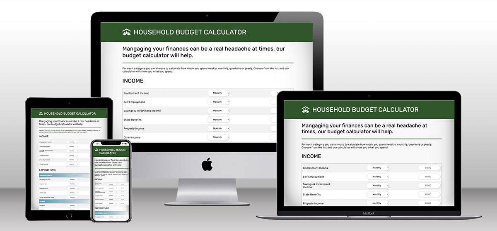
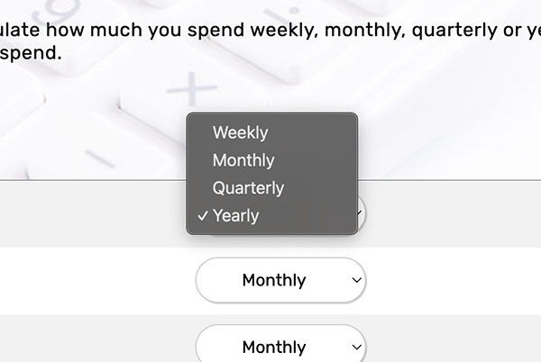
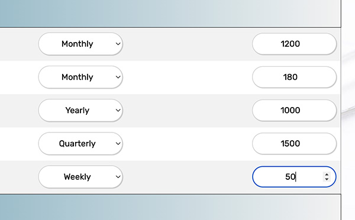
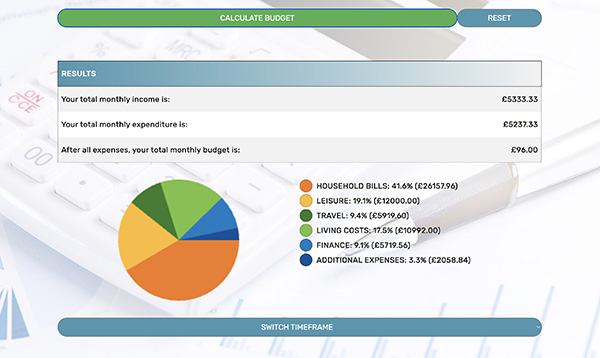
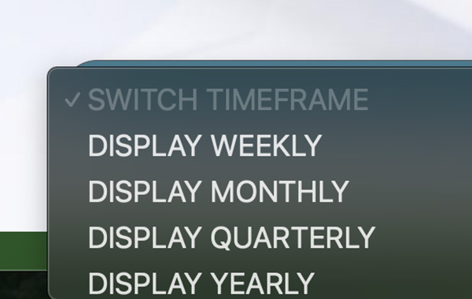

# Household-Budget-Calculator



**Live Demo**: [https://p-coughlan.github.io/Household-Budget-Calculator/](https://p-coughlan.github.io/Household-Budget-Calculator/)

## Table of Contents

- [Description](#description)
- [Features](#features)
- [Screenshots](#screenshots)
- [Technologies](#technologies)
- [Javascript Functionality](#javascript-functionality)
- [Installation](#installation)
- [Usage](#usage)
- [Project Structure](#project-structure)
- [Data Categories](#data-categories)
- [Testing](#testing)
- [Contributing](#contributing)
- [Author](#author)
- [Acknowledgements](#acknowledgements)


## Description

The Household Budget Calculator is a client-side web application built with HTML, CSS, and JavaScript. It helps users manage their finances by allowing them to enter various incomes and expenditures, select their frequency (weekly, monthly, quarterly, or yearly), and view a detailed breakdown of their budget along with an interactive pie chart.

## Features

- **Dynamic Tables**: Income and expenditure tables are generated on page load based on predefined categories.
- **Frequency Conversion**: Automatically converts all inputs to a monthly baseline (default), with the option to switch views to weekly, quarterly, or yearly figures.
- **Budget Calculations**: Computes total income, total expenditure, and net budget.
- **Interactive Pie Chart**: Visualizes expenditure categories and percentages using the HTML5 Canvas API.
- **Timeframe Switcher**: Allows users to toggle results between different timeframes without reloading the page.
- **Reset Functionality**: Clears all inputs and results to start a new calculation.
- **Responsive Design**: Styled with CSS variables, Flexbox, and Google Fonts for a clean, accessible interface.

## Screenshots

  
_Frequency of income/expenditure type selection_  

  
_Adding amounts to expenditures with differing frequencies_  

  
_Budget breakdown and pie-chart display_  

  
_Results timeframe selector_  

## Technologies

- **HTML5** for markup structure  
- **CSS3** with custom variables and Flexbox for layout  
- **JavaScript (ES6)** for dynamic functionality and Canvas API for chart rendering  
- **Font Awesome** for icons  

## JavaScript Functionality

1. **Dynamic Table Generation**  
   - On page load, the script reads a predefined list of income and expense categories and injects rows into the corresponding `<table>` elements.

2. **Frequency Conversion Logic**  
   - Each input row has a dropdown for frequency (Weekly / Monthly / Quarterly / Yearly).  
   - When the user calculates or switches timeframe, all values are normalized to a monthly baseline using conversion factors (×4.33 for weekly, ÷3 for quarterly, ÷12 for yearly, etc.).

3. **Budget Calculation**  
   - Gathers all normalized income and expense values, sums them, and computes the net budget.  
   - Updates the DOM to display total income, expenditure, and remaining budget.

4. **Chart Rendering**  
   - Uses the HTML5 Canvas API to draw a pie chart.  
   - Calculates each category’s percentage of total expenditure, assigns colors, and renders slices and labels dynamically.

5. **Event Handling**  
   - **Calculate Budget** button: triggers normalization, calculation, and chart redraw.  
   - **Switch Timeframe** dropdown: re-normalizes existing figures without a full page reload.  
   - **Reset** button: clears all inputs, removes result text, and resets the canvas.

6. **Error Handling & Validation**  
   - Non-numeric inputs are safely coerced to zero.  
   - Edge cases (all zeros, missing selections) are handled gracefully to avoid NaN or empty-chart states.


## Installation

To install and run the project locally:

1. Clone the repository.  
2. Navigate into the project directory.  
3. Open the `index.html` file in your browser, or optionally serve the folder using a simple HTTP server.

Alternatively, view the live version on GitHub Pages: [https://p-coughlan.github.io/Household-Budget-Calculator/](https://p-coughlan.github.io/Household-Budget-Calculator/)

## Usage

1. Under **Income**, enter amounts for each income category and select the appropriate frequency.  
2. Under **Expenditure**, enter amounts for each expense and their frequency.  
3. Click **Calculate Budget** to see:
   - Total income  
   - Total expenditure  
   - Net budget (income minus expenses)  
   - A pie chart breakdown of expenditures by category  
4. Use the **Switch Timeframe** dropdown to view results on a weekly, monthly, quarterly, or yearly basis.  
5. Click **Reset** to clear all inputs and start over.  

## Project Structure
```
Household-Budget-Calculator/
├── index.html
├── assets/
│   ├── css/
│   │   └── style.css
│   ├── javascript/
│   │   └── script2.js
│   ├── images/
│   │   └── budget-lg.jpg
│   └── readme/
│       ├── hbc-responsive.jpg
│       └── structure.jpg
└── README.md         # Project documentation
```

## Data Categories

### Income

- Employment Income  
- Self Employment Income  
- Savings & Investment Income  
- State Benefits  
- Property Income  
- Other Income  

### Expenditure

- **Household Bills**: Mortgage or Rent, Council Tax, Maintenance, Utility Bills, Other Household Costs  
- **Leisure**: Holidays, Hobbies, Sports Memberships, Entertainment, Other Leisure Costs  
- **Travel**: Fuel, Vehicle Maintenance, Vehicle Tax, Parking Costs, Public Transport, Other Travel Costs  
- **Living Costs**: Groceries, Healthcare, Cigarettes & Tobacco, Other Living Costs  
- **Finance**: Insurance, Loan Repayments, Savings Payments, Other Financial Costs  
- **Additional Expenses**: Gifts, Charity Donations, School & Childcare, Pet Costs, Other  

## Testing

| Feature                     | Test Case                                                                 | Expected Outcome                                                     |
|-----------------------------|---------------------------------------------------------------------------|----------------------------------------------------------------------|
| Dynamic Table Generation    | Load the page                                                            | Income & expenditure tables render with one row per predefined category |
| Frequency Conversion        | Enter “100” as weekly income under Employment, select Monthly baseline    | Monthly income displays as £433.33                                     |
| Budget Calculation          | Populate various income/expenditure fields, click **Calculate Budget**    | Total income, total expenditure, net budget, and category breakdown display correctly |
| Pie Chart Rendering         | After calculation, inspect the pie chart                                  | Pie chart segments correspond to each expenditure category and percentages match output |
| Timeframe Switcher          | Calculate monthly figures, then switch to Quarterly and Yearly           | Figures update to 3× and 12× monthly values respectively               |
| Reset Functionality         | Enter values and click **Reset**                                          | All input fields clear and result section resets to empty             |
| Input Validation            | Enter non-numeric strings (e.g. “abc”) in an amount field and Calculate   | Invalid entries are treated as zero or user is prompted; no NaN errors |
| Responsive Design           | Resize browser to mobile widths (≤ 480 px)                                 | Layout stacks vertically, inputs and buttons remain accessible        |


## Contributing

Contributions, issues, and feature requests are welcome! Feel free to fork the repository and submit a pull request.

## Author

Patrick Coughlan

## Acknowledgements

I would like to extend my sincere thanks to:

- **My Tutor at WAES, Komal Karir:** For excellent tutorage, invaluable guidance and encouragement.
- **My Code Institite Mentor, Spencer Barribal:** For your insights and support.
- **My Fellow L5 Web Application Development Students:** For your collaboration and feedback.

---
